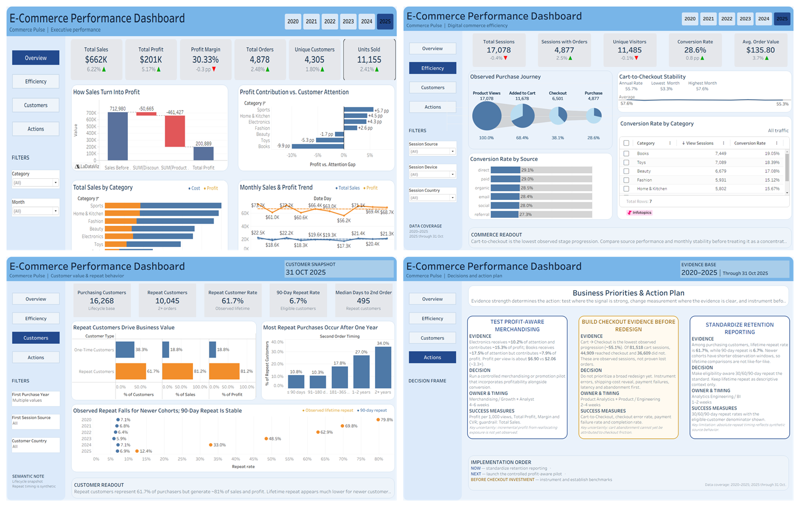
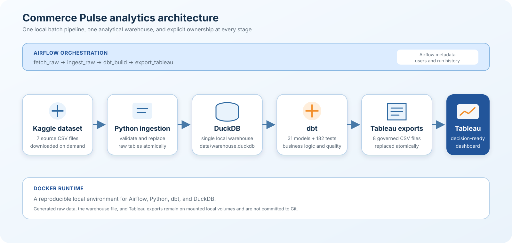

# Commerce Pulse — E-commerce Profitable Growth Analytics

Commerce Pulse is an end-to-end analytics engineering project built on Kaggle's [E-commerce Transactions + Clickstream dataset](https://www.kaggle.com/datasets/wafaaelhusseini/e-commerce-transactions-clickstream). It turns raw transaction and clickstream data into tested analytical models and a decision-oriented Tableau dashboard.

The project answers one management question:

> **How can the company improve profitable growth by converting more high-quality traffic, increasing repeat purchasing, and prioritizing products that create sustainable customer and financial value?**

The evidence covers **1 January 2020–31 October 2025**. The project uses **Python, DuckDB, dbt, Apache Airflow, Docker, and Tableau**.

## Key findings

1. **Customer attention and profit contribution are not the same.** Electronics receives **10.2% of product-view sessions** but contributes **15.3% of estimated gross profit**. Books receives **17.5% of views** but contributes only **7.9% of profit**. Estimated profit per viewed session is **$6.90 for Electronics versus $2.06 for Books**—about a 3.3× difference.

2. **Cart-to-checkout is the weakest observed funnel transition, but there is no clear evidence of deterioration.** Of **81,518 sessions that reached cart**, **44,909 reached checkout**, a **55.1% observed progression rate**. Monthly performance remained relatively stable, and the source data does not identify checkout errors, payment failures, shipping-cost reveal, or latency.

3. **Retention conclusions change with the measurement window.** Repeat customers represent **61.7% of purchasers** and generate about **81.2% of sales and estimated profit** over the observed customer lifetime. Across a different, eligibility-adjusted horizon, the 90-day repeat rate is **under 7%**, while the median time to a second order is **495 days**. Newer cohorts have shorter observation windows, so lifetime cohort comparisons are not like-for-like.

## Business recommendations

- **Now — standardize retention reporting.** Make eligibility-aware 30/60/90-day repeat rates the operating standard and keep lifetime repeat as descriptive context only.
- **Next — test profit-aware merchandising.** Run a controlled placement or promotion pilot using profit per 1,000 views, total profit, margin, conversion rate, and total sales as the measurement set.
- **Before checkout investment — improve instrumentation.** Capture checkout errors, payment failures, shipping-cost reveal, latency, and abandonment before committing to a broad redesign.

## Dashboard



The workbook is organized around four decisions:

- **Overview:** sales, profit, margin, category economics, and monthly performance.
- **Efficiency:** traffic quality, observed purchase progression, source performance, and funnel stability.
- **Customers:** repeat behavior, customer value, cohort comparability, and second-order timing.
- **Actions:** evidence, decision, owner, timing, success measures, and uncertainty for each priority.

Open the source workbook at [tableau/dashboard.twb](tableau/dashboard.twb). Tableau may require **Edit Connection** after cloning so each source points to the local `data/export` directory.

## Architecture



Airflow orchestrates four pipeline stages while dbt owns model-level dependencies. DuckDB is the analytical warehouse, and Docker provides a reproducible local runtime.

## Data modeling and reliability

The dbt project contains **31 models** across four layers:

```text
staging → intermediate → dimensions/facts → reporting and analysis marts
```

The dimensional core is the reusable analytical backbone. Specialized marts are retained only when dashboard grain or business logic justifies them. This keeps metric definitions governed in dbt while acknowledging that highly aggregated marts reduce flexible cross-domain filtering in Tableau.

Every pipeline run executes **182 dbt tests**, including **27 cross-model reconciliation tests**, before replacing the eight Tableau export files. Coverage includes grain and key constraints, purchase-to-order matching, order-line financial reconciliation, funnel consistency, customer retention semantics, and mart-to-core totals.

- [Model inventory and dependency map](dbt_project/docs/model_inventory.md)
- [Metric definitions](dbt_project/docs/metric_definitions.md)
- [Acceptance report](dbt_project/analyses/acceptance_report.sql)

## Run the project

Requirements: Git, Docker Desktop with Docker Compose, and internet access for the initial image build and Kaggle download.

```bash
git clone https://github.com/gionhengayhe/commerce-pulse.git
cd commerce-pulse
cp .env.example .env
docker compose up --build -d
```

Open [http://localhost:8080](http://localhost:8080), sign in with `airflow` / `airflow` unless changed in `.env`, then enable and trigger `commerce_pulse_daily`.

```text
fetch_raw → ingest_raw → dbt_build → export_tableau
```

The run downloads and validates seven source CSVs, rebuilds the DuckDB raw layer, builds and tests the analytical models, then atomically replaces eight Tableau-ready CSVs in `data/export`.

### Run without Docker

```powershell
python -m venv .venv
.venv\Scripts\Activate.ps1
pip install -r requirements.txt

python airflow/scripts/fetch_raw.py
python airflow/scripts/load_raw.py
dbt build --project-dir dbt_project --profiles-dir dbt_project
python airflow/scripts/export_tableau.py
```

## Limitations

- The public source behaves like synthetic data; absolute repeat-purchase timing should not be treated as a real-world benchmark.
- Product costs are a current catalog snapshot, so gross profit is an estimate rather than accounting-grade historical profit.
- Funnel stages are observed session states and do not establish why customers stopped progressing.
- Marketing spend is unavailable, so CAC and ROAS cannot be evaluated.
- There is no stable anonymous visitor identifier, limiting cross-session acquisition analysis.
- Review text contains only five unique values, so NLP would add complexity without credible analytical value.
