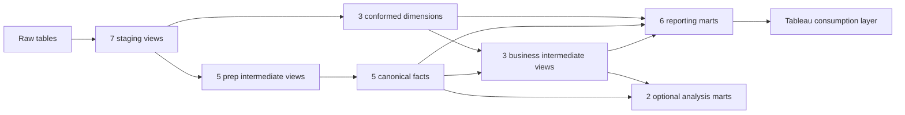

# Model inventory and dependency audit

## Scope and decision rules

This inventory reflects the current dbt project and the Tableau consumption
layer. Dependencies are direct dbt `ref()` dependencies unless Tableau is
explicitly named.

- **CORE — KEEP:** reusable warehouse foundation or required transformation contract.
- **REPORTING — KEEP:** purpose-built output used by the final Tableau dashboard.
- **ANALYSIS — OPTIONAL:** valid analytical output without an active final-dashboard worksheet.
- **REMOVE:** incorrect, redundant, or unreferenced logic with no retained analytical value.

| Decision | Models |
|---|---:|
| CORE — KEEP | 23 |
| REPORTING — KEEP | 6 |
| ANALYSIS — OPTIONAL | 2 |
| REMOVE | 0 |
| **Total** | **31** |

## Dependency overview

The dbt DAG represents transformation lineage. It does not automatically
represent BI relationships between separately exported tables. Fact-to-dimension
join contracts are documented separately below.

## Staging models

| Model | Grain | Upstream | Direct downstream models | Final role | Decision |
|---|---|---|---|---|---|
| `stg_customers` | One customer | `source(raw.customers)` | `dim_customer`, `dim_date` | Source-conformed customer input | CORE — KEEP |
| `stg_products` | One product | `source(raw.products)` | `dim_product`, `int_order_lines_enriched` | Source-conformed product input | CORE — KEEP |
| `stg_sessions` | One browsing session | `source(raw.sessions)` | `dim_date`, `fct_events`, `int_purchase_events_matched_to_orders`, `int_session_funnel` | Source-conformed session input | CORE — KEEP |
| `stg_events` | One clickstream event | `source(raw.events)` | `dim_date`, `fct_events`, `int_purchase_events_matched_to_orders`, `int_session_funnel` | Source-conformed event input | CORE — KEEP |
| `stg_orders` | One order | `source(raw.orders)` | `dim_date`, `fct_orders`, `int_customer_order_sequence`, `int_order_financials`, `int_order_lines_enriched`, `int_purchase_events_matched_to_orders` | Source-conformed order input | CORE — KEEP |
| `stg_order_items` | One retained source order line | `source(raw.order_items)` | `int_order_lines_enriched` | Preserves source rows and stable row identity | CORE — KEEP |
| `stg_reviews` | One submitted review | `source(raw.reviews)` | `dim_date`, `fct_reviews` | Source-conformed review input | CORE — KEEP |

## Prep intermediate models

| Model | Grain | Upstream | Direct downstream models | Final role | Decision |
|---|---|---|---|---|---|
| `int_purchase_events_matched_to_orders` | One purchase event matched to one order | `stg_events`, `stg_sessions`, `stg_orders` | `fct_events`, `fct_orders`, `int_session_funnel` | Centralizes deterministic purchase-to-order attribution | CORE — KEEP |
| `int_order_lines_enriched` | One retained source order line | `stg_order_items`, `stg_orders`, `stg_products` | `fct_order_lines`, `int_order_financials` | Allocates discounts and estimates line economics | CORE — KEEP |
| `int_order_financials` | One order | `int_order_lines_enriched`, `stg_orders` | `fct_orders` | Reconciles line rollups to authoritative order totals | CORE — KEEP |
| `int_customer_order_sequence` | One order | `stg_orders` | `fct_orders` | Adds deterministic order sequence and repeat timing | CORE — KEEP |
| `int_session_funnel` | One session | `stg_sessions`, `stg_events`, `int_purchase_events_matched_to_orders` | `fct_sessions` | Centralizes session funnel flags, timing, and order matching | CORE — KEEP |

## Dimensions and facts

| Model | Grain | Upstream | Direct downstream models | Final role | Decision |
|---|---|---|---|---|---|
| `dim_customer` | One customer | `stg_customers` | `mart_customer_lifecycle` | Conformed customer dimension | CORE — KEEP |
| `dim_product` | One product | `stg_products` | `int_category_session`, product/category/customer marts | Conformed product dimension and current catalog economics | CORE — KEEP |
| `dim_date` | One calendar day | Five staging date domains | `mart_executive_daily` | Conformed calendar spine | CORE — KEEP |
| `fct_events` | One clickstream event | `stg_events`, `stg_sessions`, purchase matching | `int_product_session` | Canonical atomic behavioral fact | CORE — KEEP |
| `fct_order_lines` | One retained source order line | `int_order_lines_enriched` | Product/category/customer/executive models | Canonical product sales and profitability fact | CORE — KEEP |
| `fct_orders` | One order | Orders, financials, sequence, purchase matching | Session, cohort, customer, channel, and executive models | Canonical order, attribution, and order-economics fact | CORE — KEEP |
| `fct_sessions` | One session | `fct_orders`, `int_session_funnel` | Product, channel, customer, executive, and unique-visitor models | Canonical session and funnel fact | CORE — KEEP |
| `fct_reviews` | One review | `stg_reviews`, `fct_orders` | Product/category/customer marts | Canonical structured review fact | CORE — KEEP |

## Business intermediate models

| Model | Grain | Upstream | Direct downstream models | Final role | Decision |
|---|---|---|---|---|---|
| `int_product_session` | One session-product pair | Event, session, order, and line facts | `int_category_session`, `mart_product_performance_monthly` | Reusable product behavior and purchase intersection logic | CORE — KEEP |
| `int_category_session` | One session-category pair | `int_product_session`, `dim_product` | `mart_category_performance_monthly` | Prevents category session double-counting across products | CORE — KEEP |
| `int_customer_cohort_months` | One purchasing customer per observable cohort-age month | `fct_orders` | `mart_cohort_retention_monthly` | Analytical support for right-censoring-safe cohort eligibility and activity | CORE — KEEP |

## Mart models

| Model | Grain | Upstream | Current consumer | Final role | Decision |
|---|---|---|---|---|---|
| `mart_executive_daily` | One calendar day | `fct_sessions`, `fct_orders`, `fct_order_lines`, `dim_date` | Tableau `DS Executive` | Executive KPI, trend, profit, and customer-YTD reporting | REPORTING — KEEP |
| `mart_channel_funnel_daily` | One day-source-device-country combination | `fct_orders`, `fct_sessions` | Tableau `DS Funnel` | Governed acquisition and session-funnel reporting | REPORTING — KEEP |
| `mart_purchase_journey_daily` | One day-source-device-country-stage-slice combination | `mart_channel_funnel_daily` | Tableau purchase-journey visuals | Governed stage-and-slice scaffold for the observed journey | REPORTING — KEEP |
| `mart_customer_lifecycle` | One customer | Customer/product dimensions and commercial facts | Tableau `DS Customer` | Retention, repeat behavior, RFM, and lifetime economics | REPORTING — KEEP |
| `mart_category_performance_monthly` | One month-category | Category sessions, order lines, reviews, products | Tableau `DS Category` | Category attention, conversion, sales, and profit reporting | REPORTING — KEEP |
| `mart_unique_visitor_sessions` | One session | `fct_sessions` | Tableau distinct-visitor calculations | Exact period-level distinct visitors under traffic filters | REPORTING — KEEP |
| `mart_product_performance_monthly` | One month-product | Product sessions, order lines, reviews, products | Standalone analysis | Reusable product analysis | ANALYSIS — OPTIONAL |
| `mart_cohort_retention_monthly` | One first-order cohort and cohort-age month | `int_customer_cohort_months` | Standalone analysis | Reusable cohort analysis | ANALYSIS — OPTIONAL |

## Fact-to-dimension semantic join contracts

These relationships are analytical contracts and schema tests, not necessarily
SQL `ref()` edges in the transformation DAG.

| Fact | Join | Dimension or parent | Cardinality |
|---|---|---|---|
| `fct_sessions` | `customer_id` | `dim_customer.customer_id` | Many sessions to one customer |
| `fct_sessions` | `session_date` | `dim_date.date_day` | Many sessions to one date |
| `fct_events` | `session_id` | `fct_sessions.session_id` | Many events to one session |
| `fct_events` | `event_date` | `dim_date.date_day` | Many events to one date |
| `fct_orders` | `customer_id` | `dim_customer.customer_id` | Many orders to one customer |
| `fct_orders` | `matched_session_id` | `fct_sessions.session_id` | Many orders to one session; the current data is separately tested for one order per purchase event |
| `fct_orders` | `order_date` | `dim_date.date_day` | Many orders to one date |
| `fct_order_lines` | `order_id` | `fct_orders.order_id` | Many retained lines to one order |
| `fct_order_lines` | `product_id` | `dim_product.product_id` | Many retained lines to one product |
| `fct_order_lines` | `order_date` | `dim_date.date_day` | Many retained lines to one date |
| `fct_reviews` | `order_id` | `fct_orders.order_id` | Many reviews to one order |
| `fct_reviews` | `product_id` | `dim_product.product_id` | Many reviews to one product |
| `fct_reviews` | `review_date` | `dim_date.date_day` | Many reviews to one date |

## Tableau consumption audit

| Tableau datasource | Governed dbt/export inputs | Worksheet usage |
|---|---|---|
| `DS Executive` | `mart_executive_daily` | Active |
| `DS Funnel` | `mart_channel_funnel_daily`, `mart_unique_visitor_sessions`, `mart_purchase_journey_daily` | Active |
| `DS Customer` | `mart_customer_lifecycle` | Active |
| `DS Category` | `mart_category_performance_monthly` | Active |
| `DS Product` | `mart_product_performance_monthly` | No active worksheet dependency |
| `DS Cohort` | `mart_cohort_retention_monthly` | No active worksheet dependency |

## Architecture-freeze decision

The dimensional core remains the reusable analytical backbone. Reporting marts
are retained only where their specialized grain or BI contract adds value. The
product and cohort marts remain available for standalone analysis but are not
presented as dependencies of the final dashboard.

The purchase-journey CSV dependency gap is resolved by
`mart_purchase_journey_daily`. `mart_unique_visitor_sessions` is intentionally a
thin BI consumption contract over `fct_sessions`, not a new business fact.
